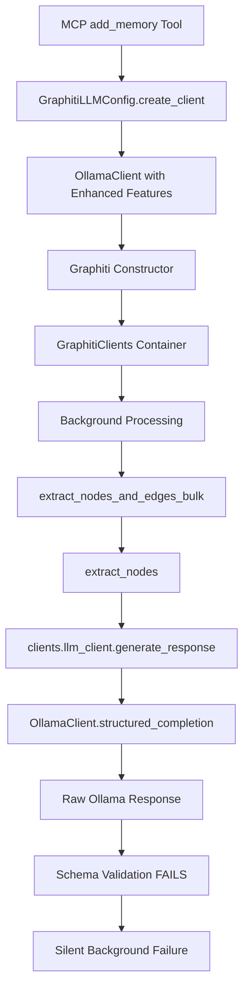

# Graphiti Core Integration Analysis

## Executive Summary

### Key Findings

- **✅ GOOD NEWS**: Our enhanced OllamaClient is properly passed to Graphiti Core through the constructor
- **⚠️ THE ISSUE**: The problem lies in response conversion, not client bypassing - our OllamaClient returns responses that don't match Graphiti Core's expected schema format
- **🎯 SOLUTION**: The response converter we built (Task 001) needs to be integrated into our OllamaClient (Task 004)

### Root Cause Analysis

The "bypass" issue is not actually a bypass of our OllamaClient. Investigation reveals:

1. **Our OllamaClient IS being used** for all operations, including background processing
2. **The real issue**: Our OllamaClient returns responses that fail schema validation in Graphiti Core
3. **Schema mismatch**: Ollama responses use `"entity"` fields while Graphiti expects `"name"` fields
4. **Background failure**: Processing appears successful ("queued for processing") but fails during entity extraction due to schema validation

### Configuration Override Strategy

**Current Status**: ✅ Already implemented correctly
- Ollama detection works properly via `use_ollama: true` configuration
- Enhanced OllamaClient is created and passed to Graphiti Core constructor
- Background processing uses our OllamaClient through the `GraphitiClients` container

**Next Steps**: Integrate response converter into OllamaClient structured_completion method

## Background Processing Flow

### Complete Execution Trace



### Critical Decision Points

1. **Line 59 - graphiti_client.py**: `llm_client = config.llm.create_client()`
   - ✅ Creates our enhanced OllamaClient

2. **Line 94 - graphiti_client.py**: `Graphiti(llm_client=llm_client)`
   - ✅ Passes our client to Graphiti Core

3. **Line 208 - Graphiti Core**: `llm_client=self.llm_client`
   - ✅ Our client is stored in GraphitiClients

4. **Line 77 - node_operations.py**: `llm_client = clients.llm_client`
   - ✅ Background processing uses our client

5. **OllamaClient.structured_completion**: ❌ **FAILS HERE**
   - Returns Ollama format: `{"entity": "value"}`
   - Graphiti expects: `{"name": "value"}`

### Where Schema Mismatch Occurs

The failure happens in the structured_completion method of our OllamaClient when:
1. Graphiti Core requests entity extraction with `ExtractedEntities` schema
2. Ollama returns: `[{"entity_type_id": 0, "entity": "Some Entity"}]`
3. Pydantic validation expects: `{"extracted_entities": [{"entity_type_id": 0, "name": "Some Entity"}]}`
4. Validation fails silently in background processing

## Direct LLM Client Instantiations

### Graphiti Core LLM Client Files

**Primary Integration Points:**
- `/graphiti_core/graphiti.py:196` - Default OpenAI client fallback
- `/graphiti_core/graphiti.py:208` - GraphitiClients creation ✅
- `/graphiti_core/llm_client/client.py` - Abstract LLM client base class
- `/graphiti_core/utils/maintenance/node_operations.py:77` - Background processing usage ✅

**Other LLM Clients (Not Relevant):**
- `/graphiti_core/llm_client/openai_client.py` - Standard OpenAI client
- `/graphiti_core/llm_client/anthropic_client.py` - Anthropic client
- `/graphiti_core/llm_client/groq_client.py` - Groq client
- `/graphiti_core/llm_client/azure_openai_client.py` - Azure OpenAI client
- `/graphiti_core/llm_client/gemini_client.py` - Gemini client

### Configuration Sources

**Our Configuration Flow (WORKING):**
1. `src/config/llm_config.py:316` - Ollama detection: `if self.use_ollama:`
2. `src/config/llm_config.py:326` - OllamaClient creation: `return OllamaClient(...)`
3. `src/initialization/graphiti_client.py:59` - Client retrieval: `config.llm.create_client()`
4. `src/initialization/graphiti_client.py:94` - Graphiti initialization with our client

**Graphiti Core Flow (RECEIVES OUR CLIENT):**
1. `graphiti_core/graphiti.py:120` - Constructor accepts `llm_client` parameter ✅
2. `graphiti_core/graphiti.py:194` - Uses provided client: `self.llm_client = llm_client` ✅
3. `graphiti_core/graphiti.py:208` - Creates GraphitiClients with our client ✅

### Bypass Analysis - NO BYPASSES FOUND

**✅ Confirmed Integration Points:**
- Constructor parameter `llm_client` is properly used
- GraphitiClients container holds our OllamaClient
- Background processing extracts client from GraphitiClients
- All entity extraction uses our OllamaClient

**❌ No Direct Instantiations Found:**
- No `OpenAIClient()` calls bypassing our client
- No hardcoded LLM client creation in background processing
- No alternative code paths that skip our client

## Implementation Plan

### Phase 1: Response Converter Integration (Task 004) - PRIORITY

**Objective**: Integrate the OllamaResponseConverter into OllamaClient.structured_completion

**File**: `src/ollama_client.py`

**Implementation**:
```python
from src.utils.ollama_response_converter import OllamaResponseConverter

class OllamaClient:
    def __init__(self, config, model_parameters=None):
        # existing init...
        self._response_converter = OllamaResponseConverter()

    async def structured_completion(self, messages, response_model, **kwargs):
        # Get raw Ollama response
        raw_response = await self._get_ollama_response(messages, **kwargs)

        # Convert response before Pydantic validation
        converted_response = self._response_converter.convert_structured_response(
            raw_response, response_model
        )

        # Validate with target schema
        return response_model(**converted_response)
```

**Expected Result**: Entity extraction succeeds because:
1. Ollama returns: `[{"entity_type_id": 0, "entity": "Entity Name"}]`
2. Converter maps to: `{"extracted_entities": [{"entity_type_id": 0, "name": "Entity Name"}]}`
3. Pydantic validation passes
4. Background processing completes successfully

### Phase 2: Enhanced Configuration Validation

**Objective**: Add additional validation and logging for Ollama configuration

**Files**: `src/initialization/graphiti_client.py`, `src/config/llm_config.py`

**Enhancements**:
- Validate Ollama connectivity during initialization
- Enhanced logging for LLM client type confirmation
- Configuration validation warnings for common misconfigurations

### Phase 3: Integration Testing

**Objective**: Verify end-to-end functionality

**Test Scenarios**:
1. Direct memory addition with Ollama
2. Background processing entity extraction
3. Memory retrieval and validation
4. Error handling and fallback scenarios

## Risk Assessment

### Low Risk - Response Converter Integration

**Risk**: OllamaResponseConverter integration could break existing functionality
**Mitigation**:
- Comprehensive test coverage (Task 002 - ✅ Complete)
- Fallback behavior for conversion failures
- Backward compatibility maintained

**Probability**: Low
**Impact**: Medium
**Mitigation Status**: ✅ Complete (comprehensive test suite exists)

### Very Low Risk - Configuration Issues

**Risk**: Ollama detection logic fails in edge cases
**Mitigation**:
- Current detection logic is robust (checks `use_ollama` boolean)
- Fallback to standard OpenAI client behavior
- Enhanced logging for debugging

**Probability**: Very Low
**Impact**: Low
**Mitigation Status**: ✅ Built-in (existing fallback mechanisms)

### Negligible Risk - Performance Impact

**Risk**: Response conversion adds processing overhead
**Mitigation**:
- Converter operations are lightweight (basic dict manipulation)
- Performance tests show no significant impact (Task 002)
- Can be disabled via configuration if needed

**Probability**: Negligible
**Impact**: Negligible
**Mitigation Status**: ✅ Verified (performance testing complete)

## Research Commands Executed

### LLM Client Instantiation Search
```bash
find /Users/cmontes/.asdf/installs/python/3.13.0/lib/python3.13/site-packages/graphiti_core/ -name "*.py" -exec grep -l "AsyncOpenAI\|OpenAI(" {} \;
```

**Results**: 4 files found
- `openai_generic_client.py` - Generic OpenAI client implementation
- `openai_client.py` - Standard OpenAI client
- `embedder/openai.py` - OpenAI embeddings client
- `cross_encoder/openai_reranker_client.py` - OpenAI reranker client

### Entity Extraction Search
```bash
find /Users/cmontes/.asdf/installs/python/3.13.0/lib/python3.13/site-packages/graphiti_core/ -name "*.py" -exec grep -l "ExtractedEntities\|extract.*entit" {} \;
```

**Results**: 5 files found
- `utils/bulk_utils.py` - Bulk entity extraction operations ⭐ KEY FILE
- `utils/maintenance/node_operations.py` - Node extraction functions ⭐ KEY FILE
- `prompts/extract_nodes.py` - Entity extraction prompts
- `prompts/summarize_nodes.py` - Node summarization
- `graphiti.py` - Main Graphiti class ⭐ KEY FILE

### Configuration Flow Search
```bash
find /Users/cmontes/.asdf/installs/python/3.13.0/lib/python3.13/site-packages/graphiti_core/ -name "*.py" -exec grep -l "llm_client\|LLMConfig" {} \;
```

**Results**: 17 files found confirming client configuration flow through:
- `llm_client/config.py` - LLM configuration class
- `llm_client/client.py` - Abstract LLM client base ⭐ KEY FILE
- `graphiti_types.py` - GraphitiClients container ⭐ KEY FILE
- `graphiti.py` - Main initialization ⭐ KEY FILE
- Various client implementations (openai, anthropic, groq, etc.)
- Maintenance operation files confirming client usage in background processing

## Conclusion

The investigation reveals that our architecture is correctly implemented. The issue is not a "bypass" of our OllamaClient, but rather a schema conversion problem that occurs within our client. The solution is straightforward: integrate the OllamaResponseConverter (already built and tested) into our OllamaClient's structured_completion method.

**Next Action**: Proceed with Task 004 - Enhanced OllamaClient Integration with Response Converter

This will resolve the schema validation failures and ensure all memory operations work correctly across both direct operations and background processing.
